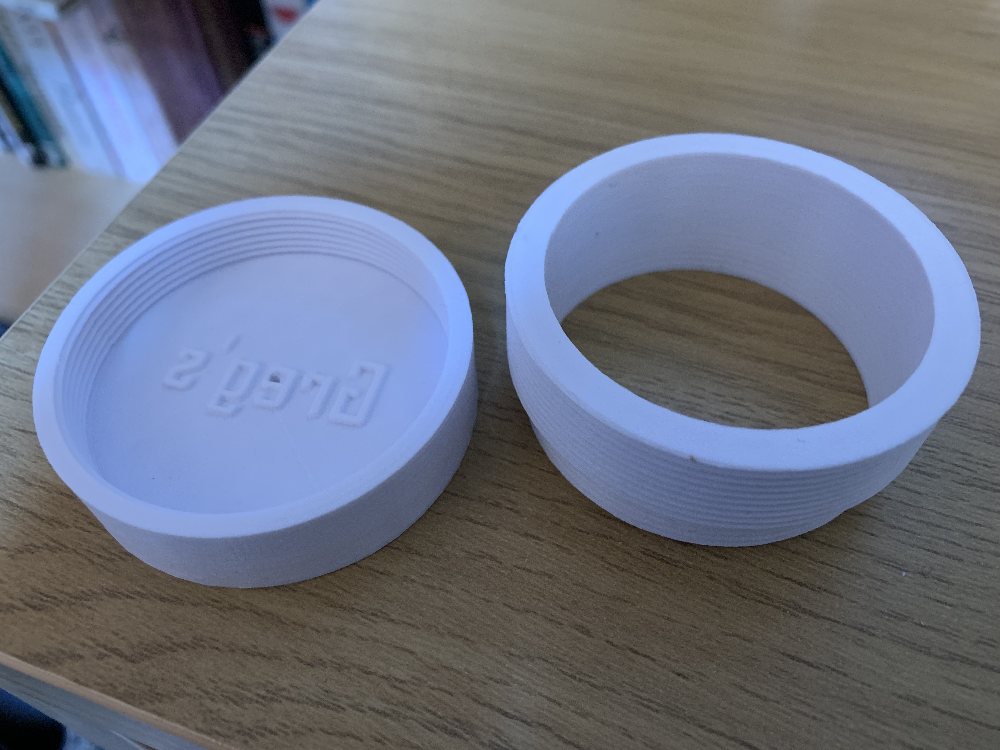
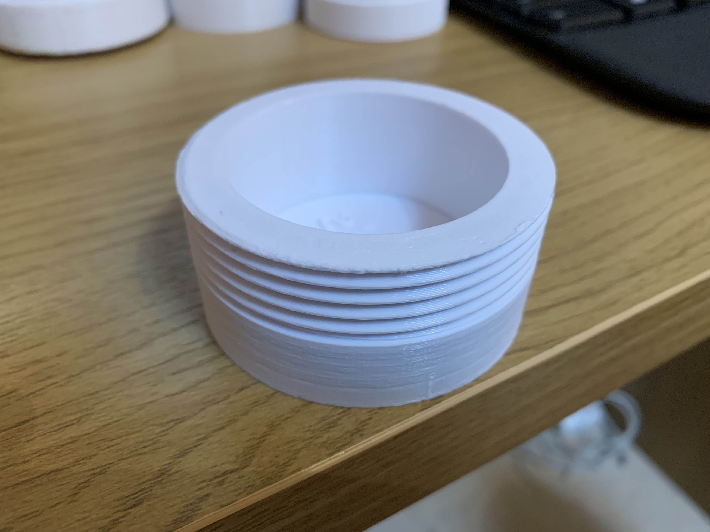
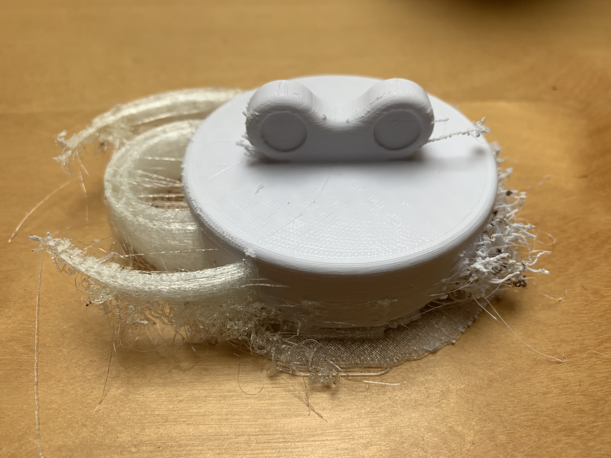
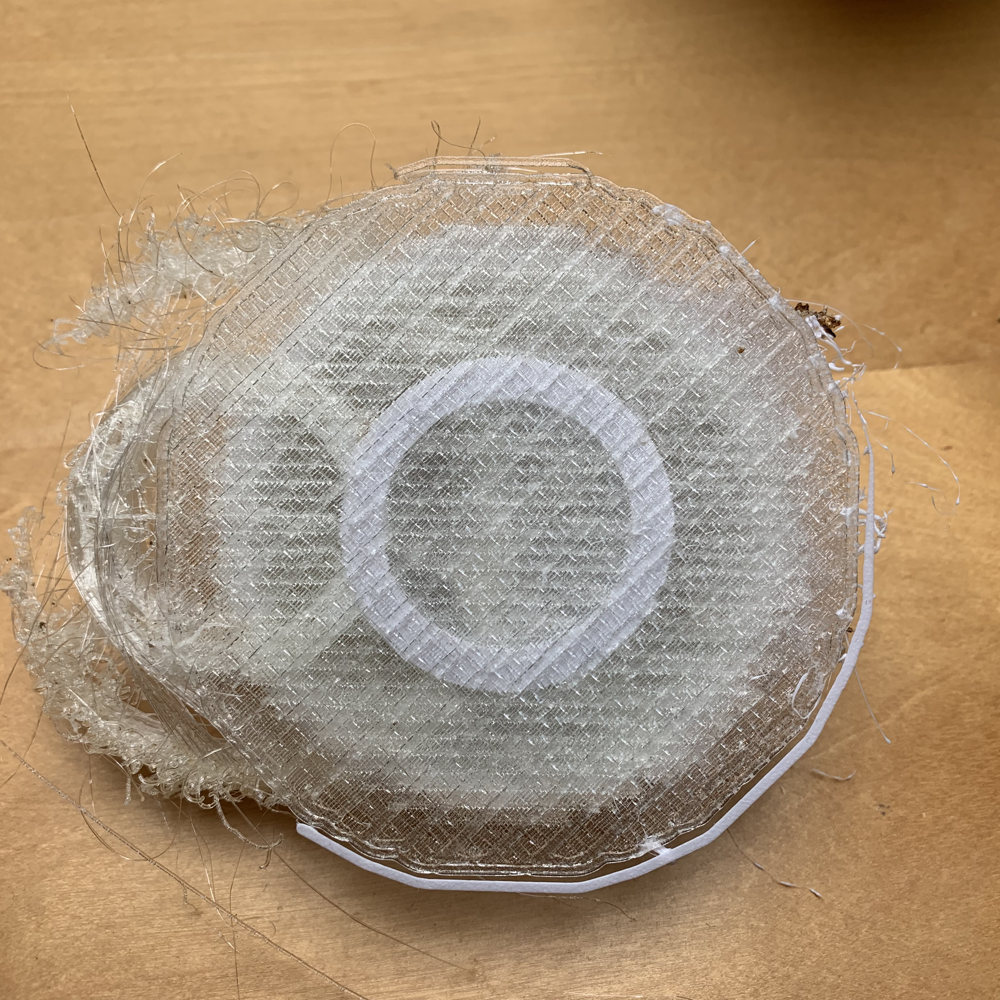
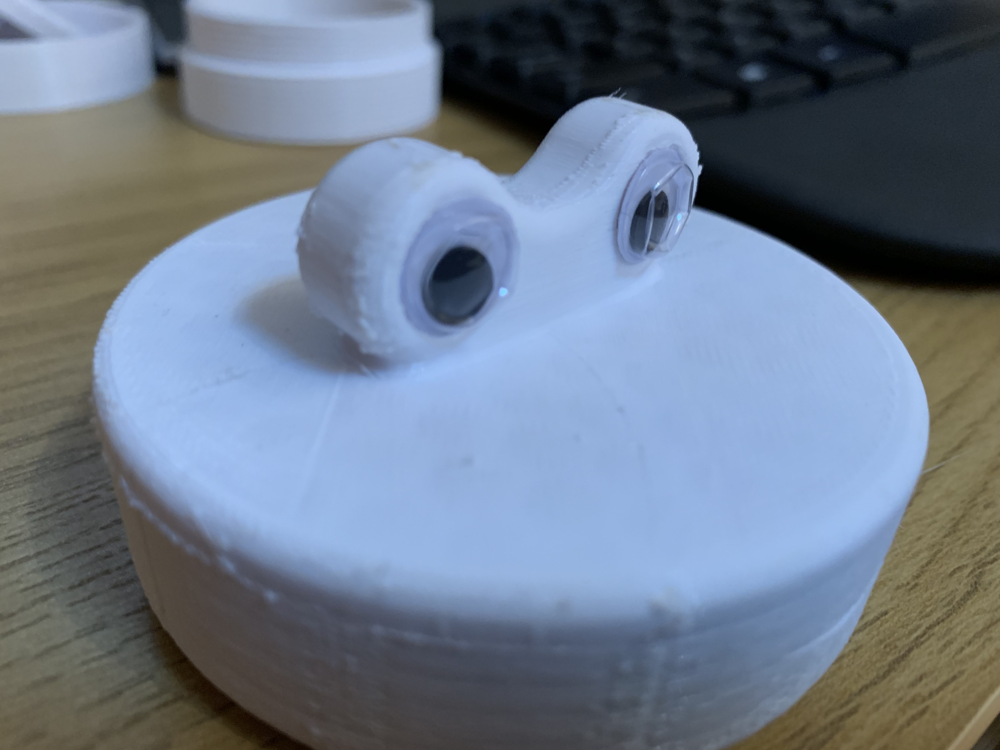
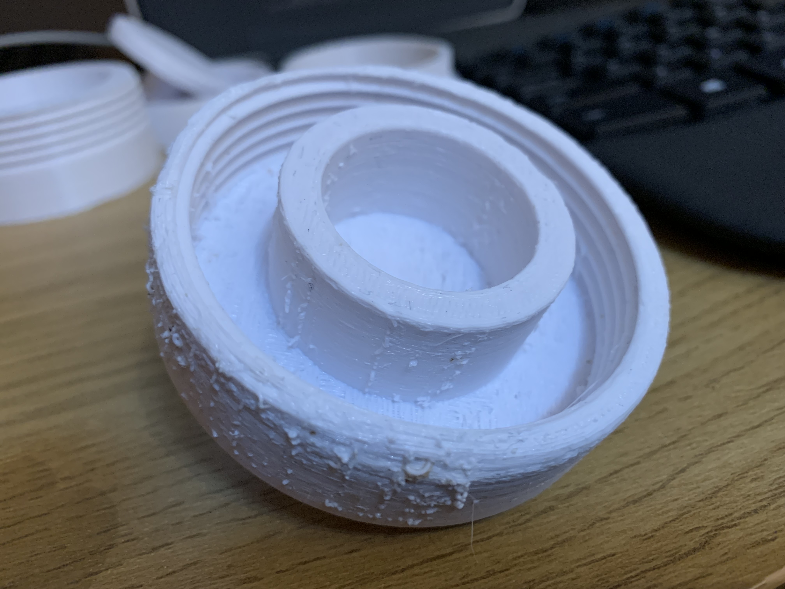

# Home Automation: 3D Printed Mechanical Soap Press
Keep ending up with bits of soap that are really hard to use? Combine them together into a new bar of soap with this soap press.

# Project structure

README.MD - this file
- CAD - The Fusion 360 model for the press
- 3DPrint - The exported STL Files, FlashPrint files (with supports) and the G-Code files to send to your 3D Printer
- media - photos used in this readme

# Lessons learnt
* Don't make the threads too fine - I couldn't get the 1mm threads to do up when printed on my 3D Printer (FlashForge Inventor) so had to increase the thread pitch. This could have been because I didn't introduce chamfers on the ends of the threads though.
  
  | Before                                  | After                                   |
  | --------------------------------------- | --------------------------------------- |
  |  |  |  

* Introduce chamfers on the ends of threads (https://forums.autodesk.com/t5/fusion-360-design-validate/thread-chamfer/td-p/5647114). Makes them easier to do up!
* Some post-processing work (sanding) will be required to make the press fit inside the walls as the print tends to be fractionally wider than the design, i.e. the walls have a slightly smaller internal diameter and the press has a slightly larger external diameter. Presumably this is due to the thickness of the extruded filament.
  
  
  
* After a lot of experimenting with soluble PVA supports for the "Top" piece of the press I finally succeeded with a 60&deg;C FlashForge blue standard bed and 210&deg;C PVA extruder head as long as I printed a raft of PVA and then printed the PLA on top of it. Without the raft I couldn't get the PVA to stick to the bed at the same time as the PLA. The PVA kept peeling off the bed during the print which resulted in a curls of PVA filament on the bed, no supports and a large ball of PVA string around the extruder head.
* I found that the PVA was still extruding when it wasn't supposed to be (almost permanently) which meant that I had a weird ghost of the component in PVA integrated into my PLA component but offset horizontally by the distance between my print heads. I haven't resolved this yet.
  
  
  
  
* The 10mm goggly eye stickers I bought didn't fit neatly inside the 10mm googly eye inset holes I created on the Top. Presumably again because the tolerances on printed product aren't that fine. I've therefore increased the inset size to 11mm.
  
  

* The outside edge of the Top didn't print well on top of the PVA. Much worse than the middle. In an attempt to improve on this I have levelled them off on the design and changed the Press to compensate.
  
  