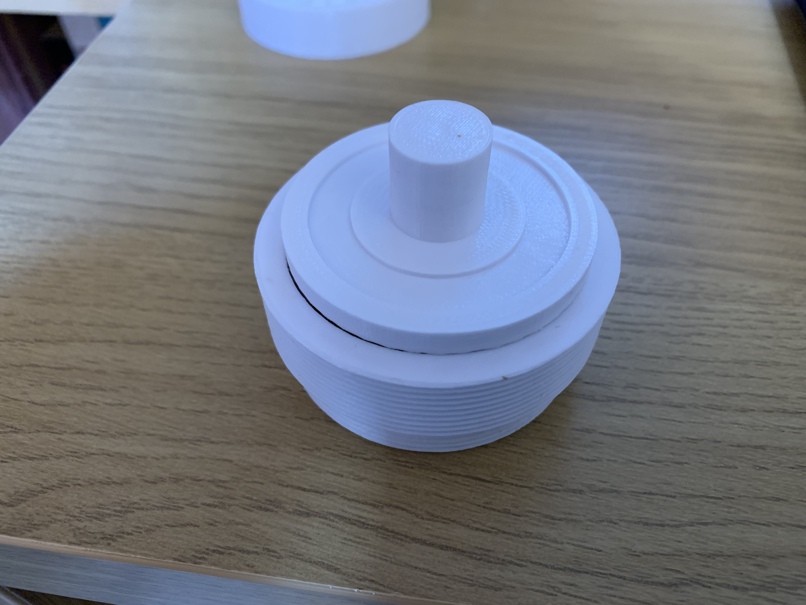

# Home Automation: 3D Printed Mechanical Soap Press
Keep ending up with bits of soap that are really hard to use? Combine them together into a new bar of soap with this soap press.

# Project structure

README.MD - this file
- CAD - The Fusion 360 model for the press
- 3DPrint - The exported STL Files, FlashPrint files (with supports) and the G-Code files to send to your 3D Printer
- media - photos used in this readme

# Lessons learnt
* Don't make the threads too fine - I couldn't get the 1mm threads to work on my 3D Printer (FlashForge Inventor) so had to increase the thread pitch. This could have been because I didn't introduce chamfers on the ends of the threads though.

* Introduce chamfers on the ends of threads (https://forums.autodesk.com/t5/fusion-360-design-validate/thread-chamfer/td-p/5647114). Makes them easier to do up!
* Some post-processing work (sanding) will be required to make the press fit inside the walls as the print tends to be fractionally wider than the design, presumably due to the thickness of the filament extrusion.

* After a lot of experimenting with soluble PVA supports for the "Top" piece of the press I finally succeeded with a 60&deg;C bed and 200&deg;C PVA extruder head as long as I printed a raft of PVA and then printed the PLA on top of it. Without the raft I couldn't get the PVA to stick to the bed at the same time as the PLA.
* I found that the PVA was still extruding when it wasn't supposed to be (almost permanently) which meant that I had a weird ghost of the component in PVA integrated into my PLA component but offset horizontally by the distance between my print heads. I haven't resolved this yet.

